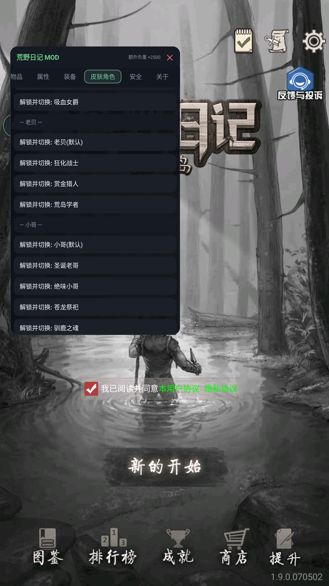
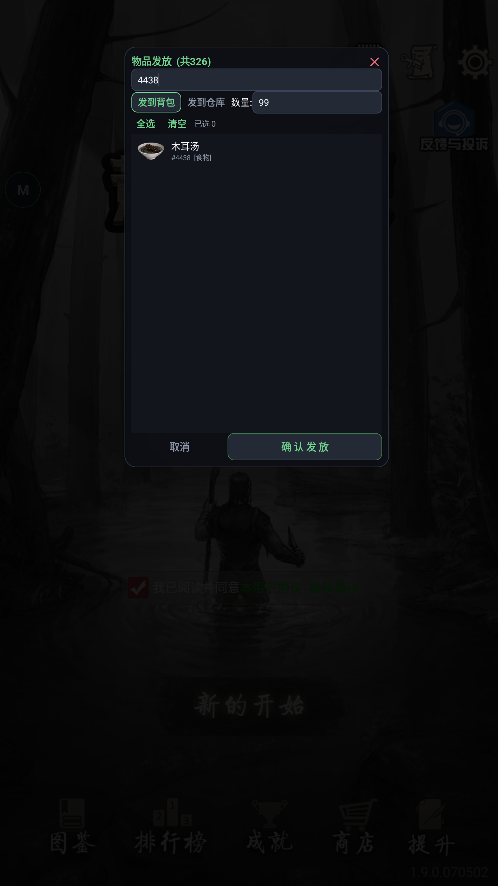
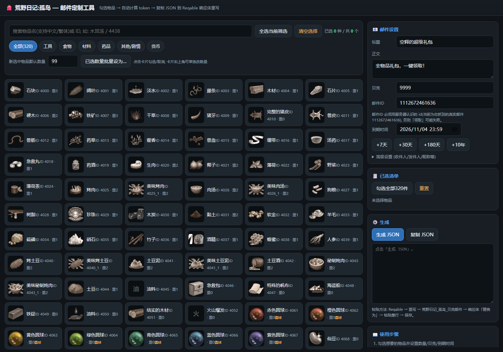

# 荒野日记:孤岛 — 逆向工程 / 邮件定制工具 / 内置 MOD 菜单

**仓库地址: https://github.com/qpalzm2332933171-droid/hyqs-island-mod**

针对手机游戏《荒野日记:孤岛》(版本 **1.9.0.0 / 1.9.0.070502**, OPPO 渠道服) 的完整逆向工程整理,
包含 **游戏源码分析、邮件系统破解、Reqable 改包教程、解封教程、直装 MOD 菜单(APK)、渠道服移植教程**。

> 本仓库是从一次真实的"改邮件 -> 被 4015 弹窗吓到 -> 反编译找原因 -> 做成内置 MOD"的完整实践里整理出来的。
> 所有结论都经过实机验证, 并且每条结论都标注了对应的**游戏源码行号**, 你可以自己复核。

---

## 目录

- [0. 免责声明](#0-免责声明)
- [1. 仓库内容与成品](#1-仓库内容与成品)
- [2. 快速开始](#2-快速开始)
- [3. 游戏技术栈与文件结构](#3-游戏技术栈与文件结构)
- [4. 邮件系统逻辑(源码级)](#4-邮件系统逻辑源码级)
- [5. 教程一: 用 Reqable 替换邮件(改包刷物品)](#5-教程一用-reqable-替换邮件改包刷物品)
- [6. MOD 菜单: 功能清单与源码分析](#6-mod-菜单功能清单与源码分析)
- [7. 教程二: 封号机制与用 Reqable 解各种封号(4015-1 ~ 4015-6)](#7-教程二封号机制与用-reqable-解各种封号4015-1--4015-6)
- [8. 教程三: 给 vivo / 华为 / 小米等其它渠道服也打上 MOD](#8-教程三给-vivo--华为--小米等其它渠道服也打上-mod)
- [9. 自己从零复刻(源码提取 + 构建)](#9-自己从零复刻源码提取--构建)
- [10. 目录结构](#10-目录结构)
- [11. FAQ](#11-faq)
- [12. 已知风险与安全设计](#12-已知风险与安全设计)
- [13. 开源协议与致谢](#13-开源协议与致谢)

---

## 0. 免责声明

- 本项目**仅用于个人学习、逆向工程研究与单机游戏体验优化**, 请勿用于任何商业用途或牟利行为。
- 修改游戏客户端、修改存档、伪造服务器响应**可能违反游戏的用户协议, 并可能导致账号被处罚**。
  仓库里记录的所有"规避检测"手段都只是**技术分析**, 是否使用、以及使用后果由你自己承担。
- **不建议在充值账号 / 主账号上做任何修改**。本仓库作者曾经因为用错 token 的邮件被客户端上报
  `cheatQueryMail`, 也在测试中触发过 `4015-5` 弹窗(详见第 7 章)。
- 游戏本体、游戏美术资源、游戏逻辑代码的版权属于其开发商/发行商。
  本仓库对**游戏源码**部分只做"学习用途的存档", 不适用 MIT 协议(见 [NOTICE.md](NOTICE.md))。
  MIT 协议只覆盖**本仓库作者自己写的**工具/文档/MOD 代码。

---

## 1. 仓库内容与成品

| 目录 | 内容 |
|---|---|
| [`game-source/`](game-source/) | 从设备里解出来的**游戏主逻辑源码**(明文, 63260 行), 以及全部配置表 `Profiles/*.json` |
| [`mail-tool/`](mail-tool/) | **邮件定制网页工具**: 图形化选物品、搜索、全选、算 token、生成可直接粘贴的响应体 |
| [`mod/`](mod/) | **直装 MOD 菜单**的全部代码: JS 注入层 + Java 原生 UI + 构建脚本 |
| [`payloads/`](payloads/) | 现成的邮件响应体样例(自带合法 token) |
| [`docs/`](docs/) | 邮件系统、反外挂/解封、MOD 源码分析、渠道服移植、构建指南、物品 ID 表 |
| [`extras/`](extras/) | 早期用 GG 修改器做的 Lua 脚本(与本项目关系不大, 留作参考) |

**成品 APK**(在 [Releases](https://github.com/qpalzm2332933171-droid/hyqs-island-mod/releases/latest) 里下载):

| 文件 | 适用 |
|---|---|
| `hyqs_island_MOD_arm64-v8a.apk` | 真机(几乎所有安卓手机)、arm64 模拟器 |
| `hyqs_island_MOD_x86.apk` | x86/x86_64 模拟器(雷电、MUMU、BlueStacks 等) |
| `hyqs_island_MOD_universal.apk` | 不确定就用这个(含全部 ABI, 89 MB) |

> 说明: 游戏本体只提供了 `arm64-v8a / armeabi-v7a / armeabi / x86` 四个 so, **官方没有 x86_64 版**。
> x86_64 的模拟器(MUMU 等)依靠模拟器的 32 位兼容层运行 `x86` 版, 实测正常。
> 不确定就装 universal 版(含全部 ABI)。

---

## 2. 快速开始

### 2.1 我想直接玩(装 MOD)

1. 按你的手机架构下载 Release 里的 APK;
2. 卸载官方版本(**MOD 版签名与官方不同, 不能覆盖安装**; 卸载前先确保账号能正常登录, 存档在服务器上);
3. 安装、进游戏、进大厅后屏幕左侧会出现一个**可拖动的悬浮球**, 点它打开菜单;
4. 默认配置已经开了"拦截作弊上报 / 跳过每日物品检查 / 拦截热更", 建议保持开启。

> MOD 只改了客户端, 服务器数据(存档)还是你原来的账号数据。
> 但是**改存档数值 = 改服务器数据**, 风险自负(第 12 章有详细风险说明)。

### 2.2 我只想改邮件

不需要装 MOD, 用抓包 + 响应体重写就行:

1. 用 [`mail-tool/index.html`](mail-tool/index.html)(双击用浏览器打开, 纯本地运行, 不联网);
2. 选好物品、数量、贝壳、到期时间, 填上你自己的 UID;
3. 点"生成", 复制出来的 JSON;
4. 在 Reqable 里建一条"响应体重写"规则, 把它填进去 —— 详细步骤见 [第 5 章](#5-教程一用-reqable-替换邮件改包刷物品)。

---

## 3. 游戏技术栈与文件结构

| 项目 | 值 |
|---|---|
| 引擎 | Cocos Creator 1.x (JSB, 原生 `libcocos2djs.so`) |
| 脚本形态 | `.jsc` = **XXTEA 加密的 zip, 里面是一个 `encrypt.js`** |
| XXTEA 密钥 | `ebf83d12-bc75-4b` |
| 主逻辑 | `assets/src/project.jsc` (408 KB -> 解密后 1.8 MB JS) |
| 启动脚本 | `assets/main.js` (会被 `_checkMainJs` 校验 md5 = `7d6dfe230ee6e39291c6738689b562fe`, **不要改**) |
| 配置表 | `assets/res/raw-assets/resources/Profiles/*.json` (物品/科技/皮肤/天赋/商店...) |
| 服务器 | `server1.xxxy.dayukeji.com:14015` (Logic) / `:15015` (账号、邮件等) |
| 包名(OPPO) | `com.dygame.hyqs.nearme.gamecenter` |
| 游戏版本号 | `1.9.0.070502` (客户端显示 1.9.0.0) |

**热更机制**(和 MOD 的持久化直接相关):

- 游戏启动时会检查热更, 把新的 `project.jsc` 下载到
  `/data/data/<包名>/files/<一串hash>/src/project.jsc`, **优先加载这份而不是 APK 里的**;
- 光改 APK 里的 `assets/src/project.jsc` 会在一次热更后被覆盖回官方版本;
- 所以 MOD 里做了一个 `copyModJs()`: 每次进程启动时把 APK 内的 `assets/src/project.jsc`
  **覆盖回热更目录**, 并且拦截 `checkUpdateInfo` 让游戏认为"已是最新"。

**存档模型**:

- 背包(`core.bag`)、仓库(`core.warehouse`)、货币(`base.coin`)、科技(`base.technology.*`)等
  都在**客户端本地**, 通过 `POST /Logic/user/updatedata` 定时同步回服务器;
- 同步请求带签名 `sign = md5(SECRET + base64(modify字符串) + uid)`,
  **服务器只验签名, 不校验数值语义** —— 这就是"改存档能改成功"的根本原因,
  也是"清作弊标记能成功"的原因(第 7 章)。

---

## 4. 邮件系统逻辑(源码级)

> 全部行号指向 [`game-source/project.beauty.js`](game-source/project.beauty.js)(美化版, 63260 行)。
> 对应关系: 美颜版行号 ≈ 游戏运行时 `project.js` 的行号, 可以直接用来对照。

### 4.1 token 校验: 为什么"改了就消失"

`DYHttpMgr.queryMail` (行 **4990-5020**) 拿到响应后, 会**逐封**校验, 不合法直接 `splice` 丢掉, 并上报:

```js
queryMail: function(e, t) {                                   // 行 4990
  ...
  this._requestCommon(function(e, a) {
    for (var n = a.data.goods_from_channel, o = n.length - 1; o >= 0; o--)
      if (!i.checkMailLegal(n[o])) {                          // 行 5005-5009
        i.clientlog("cheatQueryMail", JSON.stringify(n[o]), null, n[o].id, n[o].coin, n[o].goods);
        n.splice(o, 1);                                       // 丢弃
      }
    for (var c = (n = a.data.goods_from_user).length - 1; c >= 0; c--)
      if (!i.checkMailLegal(n[c])) { ... n.splice(c, 1); }    // 行 5011-5016
  }, n, a, "POST");
},
checkMailLegal: function(e) {                                 // 行 5021
  for (var t = "", a = ["id","type","goods","to_user","createTime","deadline","coin"], n = 0; n < a.length; ++n)
    t += e[a[n]];
  return dy.crypto.md5.hex_md5(t + d) == e.token;             // d = 行 3946 的密钥
},
```

密钥在行 **3946**:

```js
d = "apsdfAJOJ(#@&($0809283JLJOOJ",
```

**完整公式**:

```
token = MD5( id + type + goods + to_user + createTime + deadline + coin + "apsdfAJOJ(#@&($0809283JLJOOJ" )
```

- 拼接顺序**固定**如上, 数字按十进制字符串拼, UTF-8 编码, 取 32 位小写 hex;
- **不参与** token 的字段: `title` `message` `nick` `from_user` `channel` `is_receive` `is_open` `valid`
  -> 所以标题、正文、发件人随便改;
- **参与**的字段: `id` `type` `goods` `to_user` `createTime` `deadline` `coin`
  -> 只要动了其中一个, **必须重算 token**。

这就是最初的失败原因:

| 你的操作 | 结果 |
|---|---|
| 把 `100002:2` 改成 `100002:6` | goods 变了, token 没变 -> 校验失败 -> 邮件被 `splice` 丢弃 -> "邮件不显示" |
| 把 `coin:2800` 改成 `2801` | coin 变了, token 没变 -> 同上 |
| 把 `4438:8` 改成 `4438:10` | 同上 |
| **时间戳** | **完全无关**。样例里的 deadline 是 2022 年, 照样显示、照样能领 |

**结论: 不是时间戳问题, 是 token 没有重算。**

### 4.2 显示链路

1. `PanelMail.start` (行 ~42200) -> `dy.http.queryMail` -> `POST /Logic/user/querymail1` (行 4997);
2. 客户端有 **10 分钟缓存**: `MAIL_CACHE_TICK` (行 2498 / 4994),
   **改完重写规则后必须重开游戏(或等 10 分钟)**, 否则你看到的是缓存的旧响应;
3. `PanelMail.layoutUI` (行 **42328-42341**) 决定显示哪些邮件:

   ```js
   if (2 != HYData.get("base.mailList." + id) && !is_receive) { ...创建图标... }
   ```

   即"没被标记成已领取的"都会显示;
4. 打开详情 `PanelMailDetail` (行 **41789**): 标题/正文/图标都来自响应体;
   物品图标只对 `Profiles/item_profile` 里存在的 id 显示(行 41833-41840), 未知 id 只是没图, 不影响领取;
5. 详情面板初始化时会算 `dataStr = md5(goods + "" + coin)` (行 **41812**) —— 这是本地一致性校验,
   因为你改的是**整个响应体**, 客户端自己算的 dataStr 也是改动后的, 所以能通过(行 41880)。

### 4.3 领取链路: 东西到底是谁发的?

`PanelMailDetail.getItem` (行 **41870-41935**):

```js
!t.data.is_receive && 2 != n && t.data.id && dy.http.updateMail(a, function(n, i) {
  if (!n && 0 === i.errorCode && cc.isValid(t)) {     // 服务器 updatemail 返回 errorCode 0 才继续
    ...
    HYBag.updateAttr(c);                              // 行 41915 -> 本地发物品
    if (p) { HYCoin.update(p); dy.http.saveCoins(...); }  // 行 41923-41927 -> 本地加贝壳
  }
});
```

- 服务器的**唯一门槛**是 `POST /Logic/user/updatemail` 返回 `errorCode == 0`(行 41878);
  服务器只负责"把这封邮件标记成已领取", **完全不校验内容**;
- 物品/货币的发放**全部在客户端本地完成**:

| goods 里的 id | 客户端行为 | 源码 |
|---|---|---|
| `100000` 书页 | `HYData.add("base.technology.script.hasNum")` + `scriptChange` 上报 | 41888-41891 |
| `100002` 求生精选 | `base.technology.seniorScript.hasNum` | 41892-41895 |
| `100003` 天赋原石 | `base.technology.spiritCurrency` | 41896-41899 |
| `100004` 天赋结晶 | `base.technology.powerCurrency` | 41900-41903 |
| `100005` 时之砂 | `HYCommon.tryAddADCoin` **>9 会触发 4015-5 封号标记** | 41904-41906 |
| `100006` 神秘钥匙 | `HYCommon.tryAddRobotCoin`(无上限) | 41907-41909 |
| `core.*` / `base.*` | **直接写存档字段** `HYData.set(l[0], l[1])` | 41910-41912 |
| 普通物品 | `HYBag.updateAttr` 写进背包(`core.bag.<id>`), **没有负重上限检查** | 41913-41915 |
| `coin` 字段 | `HYCoin.update(p)` 直接加贝壳 | 41923-41927 |

- `channel == "_"` 的邮件领取后**不会**写 `base.mailList[id] = 2` 标记(行 41922),
  理论上同 id 可以重复领(需要服务器那边 updatemail 每次都返回 0)。

### 4.4 为什么"邮件不在服务器上"也能拿到东西

- 发放逻辑在客户端, 服务器只管标记已领取 + 记日志;
- 存档同步是 `sign = md5(SECRET + base64(modify) + uid)`, 服务器**信任客户端**提交的数值;
- 两者叠加 => **你在响应体里写什么, 就能领到什么**。
  这既是"邮件替换"能成立的原因, 也是"改存档"能成立的原因。

### 4.5 邮件字段速查

```json
{
  "id": 1112672461636,          // 邮件唯一 id(参与 token); 用真实存在过的 id 最稳
  "title": "神秘匣子奖励",       // 不参与 token, 随便改
  "nick": "%E7%A9%BA%E9%87%8A", // 发件人昵称, URL 编码, 不参与 token
  "type": "item",               // 参与 token, 一般固定 "item"
  "message": "",                // 正文, 不参与 token
  "goods": "4438:8",            // 参与 token, "id:数量;id:数量"
  "createTime": 1791196104000,  // 参与 token
  "deadline": 1793788104000,    // 参与 token
  "valid": 1,                   // 不参与
  "from_user": "dalao",         // 不参与
  "to_user": "1000000000000",   // 参与 token, 必须 = 你自己的 UID
  "channel": "_",               // 不参与; "_" 表示不写已领取标记
  "is_receive": 0,              // 不参与
  "is_open": 0,                 // 不参与
  "coin": 0,                    // 参与 token, 附带贝壳数量
  "token": "5d51a10a..."        // 上面 7 个字段的 MD5
}
```

> 小技巧: `goods` 里可以直接写 `core.xxx:9999` / `base.xxx:1` 这种键值(行 41910-41912),
> 相当于**通过一封邮件直接写任意存档字段**, 这是整个邮件系统里最"离谱"的一条路径。

---

## 5. 教程一: 用 Reqable 替换邮件(改包刷物品)

### 5.1 环境

- 安卓端 **Reqable**(需要装证书: 设置里"安装 CA 证书", 安卓 7+ 需装到系统证书或配合 LSPosed 的 TrustMeAlready 之类)
- Windows 端 **Reqable**(可选, 用来在电脑上看包)
- 或者可以直接用本仓库的 [`mail-tool/`](mail-tool/) 生成响应体

### 5.2 抓包顺序(实测有效, 照抄即可)

1. **关掉**安卓端 Reqable 的抓包(此时 Windows 端也会同步关闭);
2. 启动游戏, 等它自动登录(**登录过程中必须不抓包**, 否则会因为证书/代理导致登录失败);
3. 等 5-6 秒进到大厅界面后, **打开**安卓端 Reqable 抓包;
4. 点"继续游戏"进存档 -> 点右上角邮件图标 -> 此时 Reqable 里能看到
   `POST server1.xxxy.dayukeji.com:15015/Logic/user/querymail1`;
5. 选这条记录 -> 查看响应体 -> **右键 -> 重写(Rewrite)/ 或新建重写规则**:

   - 匹配: `http://server1.xxxy.dayukeji.com:15015/Logic/user/querymail1`
   - 动作: **替换响应体 (Replace Body)**, 内容粘贴你生成的 JSON;
6. 关掉重写规则测试前记得 **完全重启游戏**(邮件有 10 分钟缓存)。

### 5.3 生成响应体

**方法 A: 网页工具(推荐)**

1. 浏览器打开 [`mail-tool/index.html`](mail-tool/index.html);
2. 右上角填 **你的 UID**(游戏里点头像可以看);
3. 左侧搜索/筛选/勾选物品, 支持全选、按分类筛选、每样数量;
4. 设置"附带贝壳"、"有效期(到期时间)";
5. 点生成, 右边会输出完整 JSON + token 校验结果, 复制即可。

**方法 B: 命令行**

```bash
python mod/tools/mailgen.py --to-user <你的UID> --count 99 --coin 999999 --json-out mail.json
# 或自定义
python mod/tools/mailgen.py --to-user <你的UID> --goods "4438:10;100002:6" --coin 2800 --json-out mail.json
```

**方法 C: 校验 / 修复已有响应体**

```bash
python mod/tools/mailtoken.py --selftest                  # 先自检公式
python mod/tools/mailtoken.py --json mail.json            # 校验 token
python mod/tools/mailtoken.py --json mail.json --fix      # 重算 token 并写回
```

### 5.4 常见坑

| 现象 | 原因 | 解决 |
|---|---|---|
| 邮件不显示 / 只剩原来的邮件 | token 不对(改了 goods/coin/createTime/deadline/id/to_user) | 重算 token |
| 改完之后客户端把邮件上报了 `cheatQueryMail` | 同上 | 同上, 且**尽量不要反复触发** |
| 邮件显示但领取失败 | `updatemail` 服务器返回非 0(邮件 id 服务器不认) | 换一个你账号上真实存在的邮件 id |
| 规则改了没效果 | 客户端 10 分钟邮件缓存 | 完全重启游戏 |
| 显示但物品是"未知物品"没图标 | goods 里的 id 不在 `item_profile` 里 | 物品 ID 查 [docs/06-物品ID表.md](docs/06-物品ID表.md) |
| 领了 100005(时之砂)然后弹 4015-5 | `tryAddADCoin` 对 >9 的数量直接置非法标记 | 附邮件里 100005 最多 9, 见第 7 章 |

---

## 6. MOD 菜单: 功能清单与源码分析







### 6.1 注入原理(为什么是"直装")

不用 Xposed / 不用 Frida, 纯 APK 内部解决:

```
┌─────────────────────────── APK ───────────────────────────┐
│ assets/src/project.jsc   = xxtea( game-source/project.dec.js + mod/js/mod_native.js ) │
│ classes2.dex             = com.hymod.*  (Java 原生 UI : ModMenu / ModBridge / ModProvider) │
│ assets/hymod/icons/*.png = 321 张物品图标(给物品选择器用) │
│ AndroidManifest.xml      += <provider name="com.hymod.ModProvider" .../>               │
└───────────────────────────────────────────────────────────┘
```

1. **ModProvider**(空 ContentProvider):

   - 系统会在进程启动时调用它的 `onCreate()`, 这个时机比 Activity 还早;
   - 在这里把 APK 内的 `assets/src/project.jsc` **覆盖到热更目录**
     `/data/data/<包名>/files/<hash>/src/project.jsc`(遍历 files/ 下的子目录, 只覆盖已存在的);
   - 注册 `ActivityLifecycleCallbacks`, 等 `DYGame*/Cocos2dxActivity` 起来后挂上悬浮菜单;

2. **JS 层**(mod_native.js, 被追加在游戏逻辑之后执行):

   - 等 `window.dy / HYData / HYBag / HYPlayer / HYCommon / HYCoin` 都就绪后开始打 hook;
   - 通过 `jsb.reflection.callStaticMethod("com/hymod/ModBridge", ...)` 把菜单 JSON 推给 Java;
   - 玩家的每次点击/滑动通过 `window.HYMOD_ON(id, val)` 回到 JS 执行。

3. **Java 层**(ModMenu.java): 悬浮球 + 可拖动面板 + 标签页 + 输入框 + 开关, 全部原生 View 手绘。

> 为什么不用 Frida/Xposed: 那些方案要么每次启动都要连电脑, 要么依赖 root 环境;
> 直装 APK 只需要"卸载官方版 -> 安装 MOD 版"。

### 6.2 菜单结构与"是否上传服务器"

**核心安全原则: 能纯客户端计算的改动, 就绝不写进存档; 非写不可的, 由 MOD 的"安全层"负责拦截上报。**

| 标签页 | 功能 | 实现方式 | 是否写存档(=上传) |
|---|---|---|---|
| 物品 | 物品发放选择器(图标/搜索/多选/全选/数量/目标) | `HYBag.updateAttr` / `HYWarehouse.updateAttr` | ✅ 是 |
| 物品 | 背包 -> 仓库(整批搬运) | 仓库 +N, 背包 -N | ✅ 是 |
| 物品 | 给仓库补发全物品(按安全上限) | `dy.config.ITEM_CHECK_CONFIG[id].NUM` 限额 | ✅ 是 |
| 物品 | 清空背包 | `HYData.clear("core.bag.*")` | ✅ 是 |
| 物品 | 贝壳 +88888 | `HYCoin.update` + `saveCoins` | ✅ 是 |
| 物品 | 6 种特殊货币(书页/精选/原石/结晶/时之砂/钥匙) | 走各自专用接口 | ✅ 是 |
| 物品 | 邮件式发奖(goods 串 + 附带贝壳) | 直接按邮件那样本地发放 | ✅ 是 |
| 属性 | 血量写入 | `HYData.set("core.role.7002/7003")` | ✅ 是 |
| 属性 | 生命/攻击/攻速/移速/防御/闪避/命中/负重 倍率 | **hook `HYPlayer.getBaseFight` / `getFightBuff`** | ❌ 纯内存, 永不上传 |
| 属性 | 结算得分倍率 | **hook `HYCommon.calScore`** | ❌ 纯内存 |
| 属性 | 战斗倍速 1-3 倍 | 游戏自带 `base.fightSpeed` | ✅ 写存档(游戏自己的字段, 合法) |
| 属性 | 无敌 / 一击必杀 / 瞬移 | 同 hook | ❌ 纯内存 |
| 装备 | 武器防具攻击/防御/触及/暴击强化 | 改内存里的 `item_profile.E_ATTRS*` | ❌ 纯内存(可一键还原) |
| 装备 | 所有装备无限耐久 | **hook `HYEquip.updateDuration`**, 把负增量吞掉 | ❌ 纯内存 |
| 皮肤角色 | 一键解锁全提升(科技+皮肤强化+天赋+全皮肤+全角色) | 写 `base.technology.*` / `base.roleSkin.*` / `base.unlock.role.*` | ✅ 是 |
| 安全 | 拦截 clientlog / 跳过每日检查 / 过滤可疑键 / 拦截热更 / 自动存档 / 清标记 / 清冷却 | hook `dy.http.*` | — |

### 6.3 逐功能源码分析

> 行号同样指向 [`game-source/project.beauty.js`](game-source/project.beauty.js)。

#### (1) 修改背包/仓库物品数量

```js
// HYBag.updateAttr (行 12206-12225)
updateAttr: function(e, t) {           // e: map 或单个 id, t: 数量; 正数加、负数减
  ...  for (var k in map) HYData.set("core.bag." + k, ...)  // 直接写 core.bag.<id>
}
// HYWarehouse.updateAttr (行 22982-23001) 结构完全一致, 写 core.warehouse.<id>
```

- 背包和仓库结构一样, 都是 `{物品ID: 数量}` 的 map;
- **游戏对背包没有负重上限检查**(发奖路径里 `HYBag.updateAttr` 是直接调用的, 行 41915),
  所以"一键全物品到背包"很容易把数量撑到显示成 `NaN`:
  客户端 UI 用 `~~x` 之类的位运算, 超过 2^31-1 就会变成 `NaN`/负数, 表现为卡死。
  **MOD 的做法: 一键全物品只往仓库发, 并且每样按 `ITEM_CHECK_CONFIG[id].NUM` 的安全上限裁剪**(见 6.4)。

#### (2) 人物移速 / 0 秒瞬移

```js
// HYPlayer.getMoveSpeed (行 19251)
getMoveSpeed: function() { return HYData.get("core.role.7007") * HYEquip.getSpeedRatio(); }
```

MOD 直接 hook `HYPlayer.getMoveSpeed`, 返回值乘倍率:

```js
var rawSpeed = HYPlayer.getMoveSpeed;
HYPlayer.getMoveSpeed = function() {
  var v = rawSpeed.apply(this, arguments);
  var mul = buff.teleport ? 300 : buff.moveMul;   // 瞬移 = x300
  return mul && mul !== 1 ? v * mul : v;
};
```

- 只有 hook 返回值才是"完全本地"的: 存档里的 `core.role.7007` 不动, 服务器看不到;
- 顺带一提, 战斗里还有一个 `buff.move_spd`, 是从 `HYPlayer.getFightBuff` (行 19840-19870) 出来的,
  MOD 也给这个对象加了增量(两个都改才能保证战斗中/战斗外都快)。

#### (3) 邮件式发奖(本地模拟领取)

MOD 的"邮件式发奖"不经过网络, 直接照抄客户端的发奖分支:

```js
// 等价于 41904-41915 的逻辑
100005 -> HYCommon.tryAddADCoin(数量, dy.config.AD_TYPE.MAIL)   // ⚠️ >9 会触发 4015-5
100006 -> HYCommon.tryAddRobotCoin(数量, 0, "mail")
core.* / base.* -> HYData.set(键, 值)
其它 -> HYBag.updateAttr({id: 数量})
```

为什么不用这个刷物品? 因为**"邮件领取"本身是客户端本地发奖**, 但**物品种类的合法性由 item_profile 决定**,
而服务器有"每日物品异常检查"(`HYCommon.checkItem`)。MOD 里默认开着 `safeCheckItem` 跳过这个检查。

> 你之前用 GG"背包<->仓库来回倒"被封的原因:
> 仓库和背包都在 `core.*` 里, 每次倒腾都会触发 `updatedata` 上传, 服务器端有数量/时间窗的异常检测
> (上报类型 `cheatItem` / `cheatHYDataUpdate`)。
> **要点: 少改、一次改到位、别反复触发 updatedata。**

#### (4) 修改结算得分

```js
var rawScore = HYCommon.calScore;
HYCommon.calScore = function() {
  var v = rawScore.apply(this, arguments);
  return buff.scoreMul !== 1 ? Math.floor(v * buff.scoreMul) : v;
};
```

结算得分在客户端算(行 ~39599 `calScore`), 排行榜上才会体现"你这局多少分"。
倍率别开太大(建议 <= 5), 排行榜异常是**人工/服务端都可能看出来**的地方。

#### (5) 修改武器/防具属性

游戏读装备属性走 `Profiles/item_profile` 里每个装备的 `E_ATTRS / E_ATTRS_1 / E_ATTRS_2`
(分别对应 0/1/2 级强化), 字段是 `ATK / DEF / DIS(触及距离) / CRIT / HIT`。

MOD 的做法: 首次开启时**备份原值**, 之后按倍率改写内存中的配置对象; 关闭时还原。
因为只改**内存里已加载的配置**, 不写存档, 服务器完全看不到。

> 同理: `item_profile` 里的 `DURATION` 是耐久上限, `core.equip_durations.<id>` 是当前耐久。

#### (6) 无限耐久

```js
// HYEquip.updateDuration (行 15277-15294)
updateDuration: function(e, t) {   // e: {装备id: 变化量} 或 单个 id, t: 变化量(负数=消耗)
  ...  (i += t) <= 0 && (dropItem + putOut)   // 耐久 <= 0 就丢弃/损坏
}
```

MOD 拦截所有**负增量**, 直接 `return` 不传给原函数 => 耐久永远不掉;
开箱/修理的正增量照常处理。

#### (7) 战斗倍速

游戏**自带**这个字段, 官方 UI 只开放了 1x / 2x:

```js
var m = HYData.get("base.fightSpeed") || 1;     // 行 8637 / 8940
this.schedule(function(){ ...下一行字... }, .8 / m, cc.macro.REPEAT_FOREVER, 0);
```

MOD 直接把 `base.fightSpeed` 写成 1~3 的任意值 => 战斗文字弹得快 3 倍。
这是游戏自己的字段, 写进去完全合法(而且官方按钮就是这么干的, 行 8849-8850)。

#### (8) 一键解锁全提升(科技 / 皮肤强化 / 天赋 / 皮肤 / 角色)

全部是**写存档**, 但写的是"游戏内合法上限", 不是乱填:

| 项 | 存储键 | 上限来源 | 源码 |
|---|---|---|---|
| 建筑/产品科技 | `base.technology.product.<productId>.<10*floor(id/10)>` | 同一 base 下的节点数(每个节点 1 级) | 行 22160-22210, 22306-22355 |
| 皮肤角色科技 | `base.technology.skin.<productId>` | `HYTechnology.getSkinMaxLevel(pid)` = technology.json 里匹配的节点数 | 行 22219-22226 |
| 天赋 | `base.technology.talent.<tid>` | **3**(游戏源码硬上限) | 行 22169-22173 `setTalent` |
| 皮肤 | `base.roleSkin.<role>.<skinId> = "1"` | `Profiles/role_skin` | `HYRoleSkin.addSkin` 行 19880 |
| 角色 | `base.unlock.role.<roleId> = 1` + `base.shop.<shopId> = 1` | 商店配置 | 行 13553-13572 |

关键点(**"真解锁"而不是"表面文章"**):

- 科技等级会被游戏自己的函数 `HYTechnology.techSkin()` (行 22366-22386) 拿去算加成,
  它内部会用 `getSkinMaxLevel` **clamp**, 所以必须写满到真实上限, 加成才会真的生效;
- 天赋加成读取处(行 22476 / 30920-31391)只认 `base.technology.talent.<tid>` 的值,
  写 3 就等于"满级天赋";
- 皮肤加成是靠 `base.technology.skin.*`, 光解锁皮肤(roleSkin)不加属性。

**MOD 的实现顺序**: `techProductMax` -> `skinTechMax` -> `talentMax` -> 解锁全部皮肤 -> 解锁全部角色 -> `HYData.trySave()`。

#### (9) 皮肤解锁 / 角色解锁(原人民币购买)

- 皮肤: `HYRoleSkin.addSkin(role, skinId)` (行 19880) + `base.roleSkin.*`;
  切换用 `setCurSkin / setSkinState` (行 19898);
- 角色: 游戏里 4 个付费角色对应商店 id `1001→2, 1002→1, 1003→3, 1004→4`,
  写 `base.unlock.role.<roleId> = 1` 与 `base.shop.<shopId> = 1` 即可(行 13553-13572);
- MOD 里还提供"花贝壳解锁"(扣自己的贝壳再解锁), 以及"一键解锁全部付费角色"。

#### (10) 其它比较有用的 hook

| 功能 | 位置 | 说明 |
|---|---|---|
| 结算/进入战斗时的属性 | `HYPlayer.getBaseFight` (行 19399) | `life/def/dodge/atk` 都在这个对象里 |
| 战斗 buff | `HYPlayer.getFightBuff` (行 19840-19870) | `atk / atk_spd / move_spd / hitClose / hitRemote` |
| 攻速实际生效点 | 行 16412 / 16422 / 16431 / 16435 | `(weapon.spd + d[0]) * (1 + buff.atk_spd + ...)` |
| 命中/闪避 | `HYPlayer.getDef` / `getMiss` | 直接加数值 |
| 最大负重 | `HYPlayer.getMaxLoad` | 加数值 |
| 每日物品检查 | `HYCommon.checkItem` | MOD 默认跳过(避免"物品数量异常"上报) |
| 作弊上报主通道 | `dy.http.clientlog` | MOD 默认拦截(见第 7 章) |
| 装备耐久 | `HYEquip.updateDuration` / `getDuration` (行 15277-15310) | `getDuration` 读 `core.equip_durations.<id>`, 不存在时用 `item_profile.DURATION` + 科技 1009 初始化 |

### 6.4 为什么"一键全物品到背包"会 NaN 卡死

- 背包数量是 JS number, 但**渲染层**有一堆 `~~x` / `x | 0` 的位运算;
- 当单格数量超过 `2^31-1 = 2147483647`, 位运算会溢出成负数或 `NaN`, UI 直接卡死;
- 另外 `HYData.trySave()` 序列化这么大的 map 也会卡;

**MOD 的处理**:

1. "给仓库补发全物品"会用 `dy.config.ITEM_CHECK_CONFIG[id].NUM` 作为**每种物品的安全上限**(没有配置就退回输入值);
2. 想要"把背包里的东西挪到仓库"用 **背包 -> 仓库(整批搬运)**:
   仓库 +N, 背包 -N, **总物品数不变**, 不会凭空多出来;
3. 想要清空背包用"清空背包"(`core.bag` 只清背包, 仓库不动)。

---

## 7. 教程二: 封号机制与用 Reqable 解各种封号(4015-1 ~ 4015-6)

### 7.1 先分清两种"封号"

| 类型 | 表现 | 能否自己解 |
|---|---|---|
| **假封号(本地标记)** | 进游戏弹「错误4015-x」, 点确定就重启, 循环弹 | ✅ 能, 见 7.3 |
| **真封号(服务器封禁)** | `/Logic/account/login` 返回 `errorCode 1001` 或带 `invalid` 字段, 登不进去 | ❌ 不能, 只能申诉 |

绝大多数"我被封号了"都是**第一种** —— 客户端读到了存档里的"作弊标记", 自己弹的窗。

### 7.2 标记表(源码 `_checkIsCheated`, 行 53679 / 54050)

| 弹窗 | 读取的键 | 触发条件 | 怎么修 |
|---|---|---|---|
| `4015-1` | `assets/main.js` 的 md5 | 校验值 != `7d6dfe230ee6e39291c6738689b562fe` | 把 main.js 还原成官方原版(反编译包里 `assets/main.js` 不要动) |
| `4015-2` | `base.cheatAchievement` / `base.achieve_fake_profile` | 成就数据作弊 | 清零这两个键 |
| `4015-3` | `base.cheatBuildProducts` / `base.cheatBuildProduct` | 建筑产物作弊 | 清零 |
| `4015-4` | `base.cheatGoOutMax` | 远行/出门数据异常 | 清零 |
| `4015-5` | `base.coin.adCoin.illegal` | **`tryAddADCoin` 数量 > 9**(行 14265-14272) | 清零 |
| `4015-6` | `base.cheatSelectGift` | 礼包选择作弊 | 清零 |

除此之外, 客户端还有一批"上报型"信号(不一定弹窗, 但会写进服务器日志):

`cheatItem` / `cheatQueryMail` / `cheatMailMd5` / `cheatAllMailMd5` / `cheatAdCoinNum` /
`cheatAdCoinCount` / `cheatHYDataUpdate` / `cheatProduct` —— 全部走 `dy.http.clientlog`。

> 本人踩过的坑: 用邮件工具发了一封带 `100005:999` 的邮件, 领取时
> `tryAddADCoin(999, AD_TYPE.MAIL)` 直接把 `base.coin.adCoin.illegal` 置 1 (行 14267),
> 然后 `updatedata` 把这个键同步到了服务器 -> 每次登录都弹 4015-5。
> **附邮件里 100005 最多写 9**(本仓库的 `mail-tool` 已经强制限制并在界面上红字警告)。

### 7.3 用 Reqable 彻底解封(原理 + 实操)

**原理**: 标记是存在存档里的普通键, 清掉它 = 发一次"改存档"请求:

```
POST /Logic/user/updatedata
参数: uid, accountId, logicToken, gameId, gameVer, channel, aliveTime, modify, sign
其中:  modify = {"base.coin.adCoin.illegal":0}
       sign   = md5( SECRET + base64(modify 原样字符串) + uid )      // SECRET 同邮件密钥
```

服务器**只验 sign, 不检查你改了什么** -> 所以谁都能清自己的标记。

**方法 A: 让游戏自己发(最省事, 推荐)**

1. 用 Reqable 建一条 **断点(Breakpoint)** 规则, 匹配 `updatedata`;
2. 进游戏(此时已经能进, 只是会弹 4015), 让它触发一次存档上传 —— 一般是
   进存档后随便做个小动作(用掉一点体力/捡个东西)等 30 秒左右;
3. 断点命中后, 把请求体里的 `modify` **替换**成:

   ```json
   {"base.coin.adCoin.illegal":0}
   ```

   (URL 编码后是 `%7B%22base.coin.adCoin.illegal%22%3A0%7D`)
4. 然后用 [`mod/tools/unban.py`](mod/tools/unban.py) 或者网页工具的"签名计算"算出新的 `sign`,
   替换掉请求体里的 sign, 放行;
5. 完全重启游戏, 弹窗消失。

**方法 B: 直接用脚本发(不用进游戏)**

```bash
# uid / accountId / openId / logicToken 都能在你抓到的 login 响应里找到
python mod/tools/unban.py --uid <UID> --account-id <accountId> --openid <openId> \
                          --logic-token <logicToken> --key base.coin.adCoin.illegal --verify
# 一次清掉全部已知标记:
python mod/tools/unban.py --uid <UID> --account-id ... --openid ... --logic-token ... --all --verify
```

`--verify` 会重新调一次 login 接口, 打印 `errorCode / invalid / adCoin` 供你确认。

**方法 C: 装了本仓库的 MOD**

菜单 -> 安全 -> **清除作弊标记**(本地把所有 `base.cheat*` / `adCoin.illegal` 置 0) -> 自动存档上传 -> 重启游戏。
注意: 这只清**本地 + 上传**, 如果服务器上的值因为某些原因没被覆盖, 重启后还会弹, 那就用方法 A/B。

### 7.4 预防(比解封更重要)

| 规则 | 原因 |
|---|---|
| 100005(时之砂)永远不要超过 9 | `tryAddADCoin > 9` 直接置位 4015-5 |
| 不要改 `assets/main.js` | 4015-1 是 md5 校验, 改了必弹 |
| 不要碰成就、建筑产物、远行数据 | 4015-2/3/4/6 |
| 邮件 goods/coin 改了必须重算 token | 否则 `cheatQueryMail` 上报 |
| 物品数量一次性改到位, 别反复"背包<->仓库"倒 | 每次操作都会触发 `updatedata`, 服务器有异常检测 |
| 结算分数别离谱 | 排行榜是异常检测的重灾区 |
| 频率低的账号更安全 | 别把 24 小时的量在 1 分钟内刷完 |

> MOD 的安全层默认开启了: 拦截 `clientlog`(作弊上报)、跳过 `checkItem`(每日物品检查)、
> 拦截热更(防止 MOD 被官方覆盖)。**这三项是 MOD 能长期使用的关键。**

---

## 8. 教程三: 给 vivo / 华为 / 小米等其它渠道服也打上 MOD

> 本仓库的成品 APK 是 **OPPO 渠道服**(`com.dygame.hyqs.nearme.gamecenter`)。
> 其它渠道(九游/UC、vivo、魅族、小米、QQ 等)的 APK 结构几乎一样, 只要按下面的流程改 4 个地方就能自己做一份。
> 本流程**理论通用**, OPPO 之外的渠道作者没有实机账号, 遇到问题欢迎按第 11 章的排查表处理。

### 8.1 先搞懂"渠道"到底差在哪

游戏本体是同一套 Cocos 工程, 渠道差异只有三类:

1. **包名 + 渠道 SDK**: 登录/支付/广告走渠道自己的 aar(比如 OPPO 的 `nearme.apk`、
   小米的 `MiGameSDK`)。渠道号是**原生 Java 层**给 JS 的:

   ```js
   // 行 6568
   channel: function() {
     if (cc.sys.isNative)
       if ("android" == dy.utils.platform())
         return jsb.reflection.callStaticMethod("com/dygame/common/DYCommon", "channelName", "(Ljava/lang/String;)Ljava/lang/String;", "");
   }
   ```

   游戏源码里的渠道号常量表(行 39870-39878):

   | 渠道 | 渠道号 |
   |---|---|
   | 大禹/TapTap(DAYU) | `300007` |
   | 魅族(MEIZU) | `000014` |
   | 小米(MI) | `000066` |
   | **OPPO** | `000020` |
   | OPPO 支付 | `000021` |
   | UC/九游 | `000255` / `000256` |
   | QQ 游戏 | `000553` |
   | **vivo** | `000368` |

   -> 这部分**不用你改**, 目标渠道的 APK 里本来就带好了。

2. **游戏逻辑 jsc**: 同一个版本号的 jsc 内容基本一致, 但**登录/支付/广告分支**会按渠道号走不同代码。
   所以下面流程是"**用目标渠道自己的 project.jsc 打补丁**", 而不是把 OPPO 的塞过去。

3. **服务器**: 各渠道目前都是 `server1.xxxy.dayukeji.com`(渠道号作为参数传, 不是独立域名),
   所以你的账号数据是跟着渠道走的, 别指望用 vivo 渠道的 APK 登 OPPO 的号。

### 8.2 准备工具

| 工具 | 说明 |
|---|---|
| `apktool` (jar) | 解包/回编译。放到 `work/apktool/apktool.jar` |
| JDK 8+ | 编译 JavaUI(`javac`) |
| Android SDK build-tools | `d8`(编译 dex)、`zipalign`、`apksigner` |
| Python 3 + `xxtea` 库 | `pip install xxtea`, 用来解/加密 jsc |
| 一个自己的 keystore | 默认脚本用 debug keystore, 想正经发布就 `keytool -genkey` 生成 |

### 8.3 步骤(以 vivo 为例)

```bash
# 0) 拿到目标渠道的 APK(从对应应用商店下载你手机能装的那个版本), 假设叫 vivo.apk
# 1) 解包
apktool d -f -o work/apk_dec vivo.apk

# 2) 确认版本 & 解密它的 project.jsc
python mod/tools/jsc.py unpack work/apk_dec/assets/src/project.jsc /tmp/vivo_project.js
#    (如果报 "not a zip after xxtea" -> 说明 key 不是 ebf83d12-bc75-4b, 用 mod/tools/dump_xxtea.py 动态抓)
grep -o "1\.9\.0\.[0-9]*" /tmp/vivo_project.js | head    # 看一眼版本号

# 3) 把 MOD 追加到它后面, 重新加密
python - <<'PY'
import io, sys
sys.path.insert(0, "mod/tools")
import jsc
game = io.open("/tmp/vivo_project.js", encoding="utf-8").read()
mod  = io.open("mod/js/mod_native.js", encoding="utf-8").read()
n = jsc.pack((game + "\n" + mod).encode("utf-8"), "work/apk_dec/assets/src/project.jsc")
print("packed", n)
PY

# 4) 插入 ContentProvider 声明(authority 自动用 <包名>.hymod)
python mod/tools/patch_manifest.py

# 5) 复制物品图标(给菜单里的物品选择器用)
mkdir -p work/apk_dec/assets/hymod/icons && cp mail-tool/icons/*.png work/apk_dec/assets/hymod/icons/

# 6) 编译 Java UI 并回编译 APK(自动注入 classes2.dex + zipalign + 签名)
python mod/tools/build_dex.py
python mod/tools/build_apk.py
#    产物: dist/荒野日记孤岛_MOD.apk
```

> `build_apk.py` 默认会**重新执行一遍 3) 里的事情**, 所以其实你只要保证
> `work/apk_dec/assets/src/project.jsc` 是"目标渠道的解密版 + mod_native.js",
> 或者干脆让脚本自己拼(它默认拼 `game-source/project.dec.js + mod/js/mod_native.js`)。
> 跨渠道**强烈建议**按上面手动拼目标渠道自己的 jsc。

### 8.4 装到手机上

```bash
adb uninstall <目标渠道包名>     # 签名不同, 必须先卸载官方版
adb install -r dist/荒野日记孤岛_MOD.apk
```

- **不要改包名**: 游戏服务器用包名/渠道号做校验(`/user/packagecheck`, 行 1493-1508),
  改了包名轻则登录失败, 重则数据对不上;
- 存档在服务器上, 卸载重装不会丢(前提: 你能用同一渠道账号登录)。

### 8.5 排查表

| 现象 | 原因 | 处理 |
|---|---|---|
| 装不上 / 校验失败 | 签名与官方不同 | 先卸载官方版 |
| 一进游戏就闪退 | dex 没注入 / 断点没对齐 / ABI 不对 | 检查 `classes2.dex` 是否在 APK 里; 用 `zipalign -c -v 4` 校验; 只保留目标机型 ABI |
| 悬浮球不出现 | `ModProvider` 没被调用(manifest 没插进去), 或者 Activity 类名不匹配 | 看 `logcat | grep hymod`; 把 `ModProvider.maybeAttach()` 里的 `DYGame|Cocos2dxActivity` 换成该渠道真实 Activity 名 |
| 菜单出现但没有物品图标 | `assets/hymod/icons` 没拷 | 拷 321 张 png 进去重新打包 |
| 玩一会 MOD 失效了 | 被热更覆盖 | MOD 自带 `copyModJs()` + 拦截 `checkUpdateInfo`, 确认 `安全` 页的"拦截热更"是开的 |
| 登录失败 | 渠道 SDK 校验签名/包名, 或登录时开着抓包 | 关掉抓包再登录; 用渠道自己的 jsc; 实在不行换回官方版登录一次再装 MOD |
| 广告/支付按钮报错 | 渠道 SDK 的 activity 没打进 MOD(apktool 解码 aar 可能有损) | 用 `-s`(不反编译 dex)解包, 或手动把原 APK 的 `classes*.dex` 一起带上 |

### 8.6 更省事的替代方案(不想重新打包整个 APK)

- **只想改邮件**: 用 [第 5 章](#5-教程一用-reqable-替换邮件改包刷物品)的 Reqable 方案, 任何渠道都一样;
- **只想去掉封号弹窗**: 用 [第 7 章](#7-教程二封号机制与用-reqable-解各种封号4015-1--4015-6)的方法清标记;
- **不想打包**: 用 Frida 在运行时把 `mod_native.js` 注入进去(见 [docs/07](docs/07-游戏源码提取.md) 的 Frida 部分),
  适合自己玩, 不适合分享。

---

## 9. 自己从零复刻(源码提取 + 构建)

1. **解包**: `apktool d -f -o work/apk_dec <渠道APK>` (`-s` 可跳过 dex 反编译, 更快);
2. **解密 jsc**:
   - 已知 key 时: `python mod/tools/jsc.py unpack work/apk_dec/assets/src/project.jsc out.js`
     (jsc = XXTEA(zip(encrypt.js)), key = `ebf83d12-bc75-4b`);
   - key 未知/被改: 用 `mod/tools/dump_xxtea.py`, Frida hook `libcocos2djs.so!xxtea_decrypt`, 抓运行时的解密结果;
3. **美化**(可选, 强烈推荐): 用 `js-beautify` 之类的工具, 63260 行的源码看着舒服很多
   (本仓库的 `game-source/project.beauty.js` 就是美化后的);
4. **写 MOD**: 参考 `mod/js/mod_native.js` 的结构(hook -> 状态 -> 菜单 JSON -> `HYMOD_ON` 分发);
5. **打包**: 见 [第 8.3 节](#83-步骤以-vivo-为例) 或 [docs/05-构建与打包指南.md](docs/05-构建与打包指南.md);
6. **调试**: `adb logcat | findstr /i "hymod HYMOD cocos"` 能同时看到 Java 与 JS 的日志。

---

## 10. 目录结构

```
hyqs-island-mod/
├── README.md                  <- 你正在看的文件
├── LICENSE                    <- MIT(只覆盖本仓库原创代码)
├── NOTICE.md                  <- 版权说明: 游戏源码/资源不属于本仓库
├── game-source/               <- 解密出来的游戏源码 + 配置表
│   ├── project.dec.js         <- 明文游戏逻辑(1.8 MB, 用于打包)
│   ├── project.beauty.js      <- 美化版(63260 行, 用于阅读)
│   ├── project.raw.js         <- 设备动态 dump 的原始版本
│   └── Profiles/*.json        <- item_profile / technology / tech_role / role_skin / talent_profile ...
├── mail-tool/                 <- 邮件定制网页工具(离线可用)
│   ├── index.html             <- 打开它就能用
│   ├── items.js               <- 321 条物品数据(含官方分类)
│   ├── md5.js                 <- 游戏同款 MD5 实现
│   ├── gen.js                 <- 生成响应体 + 算 token 的逻辑
│   └── icons/*.png            <- 321 张物品图标(从游戏资源里提取)
├── mod/
│   ├── js/mod_native.js       <- MOD 主体(挂在游戏逻辑后面执行)
│   ├── java/com/hymod/        <- Java 原生菜单(ModMenu/ModBridge/ModProvider)
│   └── tools/                 <- 构建/邮件/解封 全套脚本
├── payloads/                  <- 现成的响应体样例(已脱敏, 需把 to_user 换成你自己的 UID)
├── docs/                      <- 详细文档(邮件/反外挂/MOD 源码分析/移植/构建/FAQ)
└── extras/脚本.lua            <- 早期 GG 修改器脚本(参考用)
```

---

## 11. FAQ

**Q: 邮件替换了但没生效?**
A: 三件事按顺序查: ① token 有没有重算; ② 有没有完全重启游戏(10 分钟缓存); ③ 重写规则匹配的 URL 对不对。

**Q: 改了邮件会不会被封?**
A: 只要 token 正确, 客户端不会上报 `cheatQueryMail`。但**领到的物品本身会进存档**,
数量离谱的话服务器侧仍可能标记。建议一次别刷太狠, 尤其别碰 100005(>9 直接触发 4015-5)。

**Q: 出现 4015-x 弹窗 = 我被封号了吗?**
A: 99% 不是。那是客户端本地弹的, 按第 7 章清掉对应的键即可。真封号是登录就失败。

**Q: MOD 版能和官方版共存吗?**
A: 不能, 包名相同但签名不同, 必须卸载官方版。想改回来就卸载 MOD 版装官方版, 存档在服务器上不会丢。

**Q: MOD 会不会被官方更新干掉?**
A: MOD 有"拦截热更"+"启动时覆盖 jsc"。但如果官方强制更新(大版本), 那就要重新解包新版本再做一遍。

**Q: 为什么一键全物品到背包会卡死/NaN?**
A: 见 6.4。用"给仓库补发全物品"或"背包->仓库(整批搬运)"。

**Q: 属性滑块重启后归位?**
A: 已经修好了: 所有滑块/开关状态存在 `cc.sys.localStorage["hymod_vals2"]` 里, 启动时 `applyState()` 恢复。
如果发现没恢复, 看看是不是被"拦截热更"关掉了导致脚本被换回官方版。

**Q: 我想在 iOS 上用?**
A: iOS 没有可玩的越狱+重签名路径(而且本游戏的 iOS 版是另一套审核逻辑), 本仓库不涉及。

---

## 12. 已知风险与安全设计

**风险(越高越危险)**

| 风险 | 说明 |
|---|---|
| 🔴 高 | 修改结算得分并上榜(服务端/人工都能看出来) |
| 🔴 高 | 短时间内大量写存档(每次 `updatedata` 都是一个可分析样本) |
| 🟠 中 | 发 100005(时之砂) > 9 -> 必然 4015-5 |
| 🟠 中 | 用错 token 的邮件 -> `cheatQueryMail` 上报 |
| 🟢 低 | 纯内存 hook(攻击/防御/移速/耐久/倍速) —— 不上传, 重启即失效 |

**MOD 的安全设计(默认开启)**

1. `dy.http.clientlog` 全量拦截(所有 `cheat*` 上报的公共通道, 行 5008/5014/28654/41882 都走它);
2. `HYCommon.checkItem` 跳过(每日物品异常检查);
3. `checkUpdateInfo` 拦截(防止 MOD 被热更覆盖);
4. `updateData` 可选过滤可疑键(默认关, 因为正常存档键名里也偶尔含 `cheat` 字样会误伤);
5. 所有"纯本地"修改(倍率类)都不写存档, 只有"发物品/解锁"这类必须落地的才写。

**作者踩坑实录(都写在文档里了)**

- 早期用 GG 反复"背包<->仓库"倒物品 -> 很快触发检测;
- 邮件 token 写错 -> 客户端上报 `cheatQueryMail`, 服务器留了记录;
- 邮件里塞 100005:999 -> `base.coin.adCoin.illegal` 置位 + 同步服务器 -> 每次登录弹 4015-5;
- 结论: **能不改存档就不改, 要改就一次到位, 频率越低越安全。**

---

## 13. 开源协议与致谢

- 本仓库**原创代码/文档/工具**以 [MIT](LICENSE) 协议开源;
- **游戏本体、解密出的游戏逻辑(`game-source/`)、物品图标、配置表**的版权属于原游戏公司,
  这里仅作为**逆向工程学习资料**收录, **不适用 MIT 协议**, 详见 [NOTICE.md](NOTICE.md);
- 感谢 Reqable/Frida/apktool/APKTool 这些工具链, 以及所有公开分享过这个游戏改包思路的网友。

**如果你也踩到了别的坑, 欢迎提 Issue / PR 补充。**
